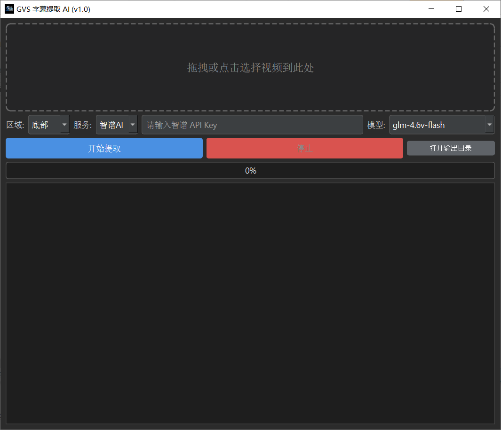

# GVS  硬字幕AI提取

**GVS** 是一款基于 **AI 视觉大模型** 的视频硬字幕提取工具。

本项目利用 **GLM-4.6V** 和 **Gemini** 等先进的多模态模型，直接“看”懂视频帧中的文字。它不仅识别准确率极高，还能利用 AI 的语义理解能力，自动处理字幕去重、断句拼接和时间轴对齐。

> 💡 **核心理念**：抛弃繁琐的本地 OCR 字典校对，把视频截图直接喂给 AI，让 AI 帮你写 SRT 字幕。

## ✨ 核心特性

- **🚀 AI 原生处理**：使用智谱 AI (glm-4.6v-flash免费模型) 或 Google Gemini 进行识别，抗干扰能力强，支持多语言。
- **🆓 免费使用**：
  - 默认支持 **智谱 AI** 的 `glm-4.6v-flash` 系列模型（**完全免费**，注册即用）。
  - 支持 **Gemini** 免费层级模型。
- **⚡ 智能批处理**：采用 1秒/帧 采样，每 20 帧打包发送，降低 API 请求频率，避免频繁限流。
- **🧠 自动去重与拼接**：利用 LLM 的上下文能力，自动合并连续的相同字幕，生成完美的 SRT 时间轴。
- **🖥️ 现代化 GUI**：基于 PySide6 构建的深色主题界面，支持拖拽操作，实时日志显示。
- **🛠️ 极速部署**：使用 `uv` 进行依赖管理，环境配置快如闪电。

## 📸 界面预览



## 🛠️ 安装指南

本项目推荐使用 [uv](https://docs.astral.sh/uv/getting-started/installation/) 进行极速部署。当然，你也可以使用传统的 pip。

### 前置要求

1.  **FFmpeg** : 用于视频截帧。
    *   **Windows**: [下载 FFmpeg](https://ffmpeg.org/download.html)，解压并将 `bin` 目录添加到系统环境变量 `Path` 中。
    *   **Mac**: `brew install ffmpeg`
    *   **Linux**: `sudo apt install ffmpeg`
    *   *验证方法*: 在终端输入 `ffmpeg -version` 不报错即可。

2.  **Python 3.10+**

### 方式一：使用 uv (推荐)

如果你是 Python 开发者或希望环境隔离更干净：

1.  安装 uv (如果未安装):
    到此页面安装：https://docs.astral.sh/uv/getting-started/installation/
2.  克隆项目:
    ```bash
    git clone https://github.com/jianchang512/gvs.git
    cd gvs
    ```
3.  同步依赖并运行:
    ```bash
    # uv 会自动根据 pyproject.toml 和 uv.lock 创建虚拟环境并安装依赖
    uv sync
    
    # 运行软件
    uv run app.py
    ```

### 方式二：使用 pip

```bash
git clone https://github.com/jianchang512/gvs.git
cd gvs

# 建议先创建虚拟环境
python -m venv venv
# Windows 激活
.\venv\Scripts\activate
# Mac/Linux 激活
source venv/bin/activate

# 安装依赖
pip install -r requirements.txt  
# 或者手动安装核心库:
pip install PySide6 Pillow requests
```

## 🔑 API Key 获取指南

本项目依赖云端 AI 模型，需要申请 API Key。以下两个渠道均有免费额度：

### 1. 智谱 AI  (免费,推荐国内用户)
*   **模型**: `glm-4.6v-flash` / `glm-4v-flash`
*   **费用**: **免费** (Flash 模型目前免费开放)
*   **获取方式**:
    1. 访问 [智谱 AI 开放平台](https://bigmodel.cn/usercenter/proj-mgmt/apikeys)。
    2. 注册账号并实名认证。
    3. 在“API Keys”页面创建一个新的 API Key。
    4. 复制 Key 填入软件即可。

### 2. Google Gemini
*   **模型**: `gemini-2.5-flash` / `gemini-3-flash-preview`
*   **费用**: 提供免费层级 (Free Tier)，也就是每天有一定额度的免费调用。
*   **获取方式**:
    1. 访问 [Google AI Studio](https://aistudio.google.com/app/apikey)。
    2. 点击 "Create API key"。
    3. 复制 Key 填入软件即可。

## 📖 使用说明

1.  **启动软件**：运行 `app.py`。
2.  **导入视频**：点击虚线框或直接将视频文件拖入软件界面。
3.  **选择区域**：
    *   大多数电影/电视剧字幕在**底部**。
    *   如果是短视频顶部标题，可选**顶部**。
    *   若不确定，可选**全画面**（Token 消耗稍多，但最稳）。
4.  **配置服务**：
    *   选择服务商（智谱AI 或 Gemini）。
    *   输入对应的 API Key（软件会自动保存，下次无需输入）。
    *   选择模型（推荐使用后缀带 `flash` 的模型，速度快且免费/便宜）。
5.  **开始提取**：点击“开始提取”按钮。
6.  **查看结果**：
    *   进度条走完后，软件会自动在当前目录下创建 `output` 文件夹。
    *   SRT 字幕文件将生成在 `output` 目录中。
    *   点击界面上的“打开输出目录”即可直达。

## ⚙️ 文件结构

```text
gvs/
├── app.py              # 主程序入口
├── config.json         # 用户配置文件（自动生成）
├── api_debug.log       # API 请求调试日志（用于排查 AI 幻觉或报错）
├── output/             # 字幕输出目录
├── pyproject.toml      # uv 项目配置
└── uv.lock             # uv 依赖锁定文件
```

## 🤝 二次开发与贡献

欢迎提交 Pull Request 或 Issue！

### 开发提示
*   **UI 修改**: 项目使用纯代码构建 PySide6 界面（无 `.ui` 文件），请直接修改 `MainWindow` 类下的 `setup_ui` 方法。
*   **AI 逻辑**: 核心逻辑在 `AIClient` 类中。如果想添加新的 LLM 支持（如 Claude 或 OpenAI），请参照 `_call_zhipu` 方法实现。
*   **图片处理**: 使用 `Pillow` 进行裁切和压缩，逻辑在 `crop_image_bytes` 函数中。

## ⚠️ 常见问题 (FAQ)

**Q: 点击开始后报错 "无法获取视频时长"？**
A: 请确保你的电脑安装了 **FFmpeg** 并且已经添加到了系统环境变量中。重启电脑或终端后再试。

**Q: 为什么识别出的字幕偶尔有错别字？**
A: 虽然 AI 很强，但在极其模糊、特效字或背景极其复杂的情况下仍可能出错。建议使用“底部”裁切模式，减少背景干扰。

**Q: 任务中途报错 "429 Too Many Requests"？**
A: 这是触发了 API 频率限制。软件内置了重试机制，会自动暂停 10 秒后重试。如果频繁出现，建议检查你的 API 额度或切换模型。

## 📜 开源协议

MIT License. 这意味着你可以免费使用、修改和分发本项目，但需保留原作者版权声明。

## 致谢

- requests
- pyside6
- 智谱AI
